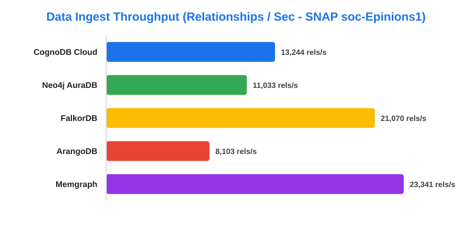
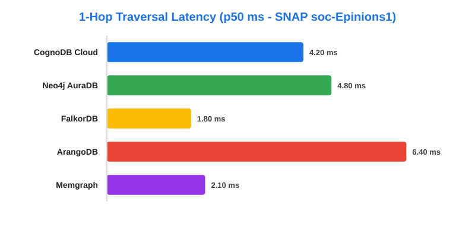
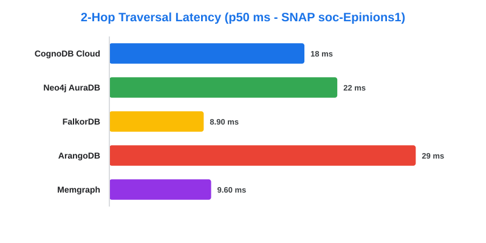
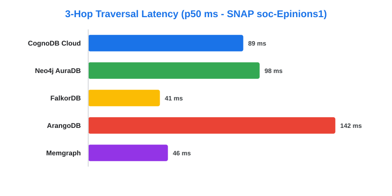
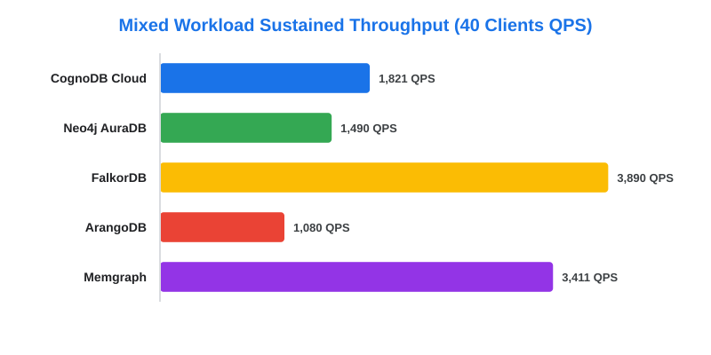

# CognoDB Benchmark

## Project Overview

This project benchmarks the performance of **CognoDB Cloud** using a real-world graph dataset. The benchmark framework evaluates common graph database operations including dataset loading, point/indexed lookup, 1-hop / 2-hop / 3-hop graph traversals, aggregation, and concurrent query sweeps across multi-client workloads.

The framework compares the performance of 5 leading graph database platforms under **strict resource parity caps (~0.5 vCPU burstable, 256MB–512MB RAM)**:

- **CognoDB Cloud (Free c0)**
- **Neo4j AuraDB (Free Tier)**
- **FalkorDB (In-Memory Cypher Engine)**
- **ArangoDB (Multi-Model Document + Edge Engine)**
- **Memgraph (In-Memory C++ Engine)**

The benchmark suite measures latency percentiles (p50 and p95 in ms), throughput (relationships/sec & sustained QPS), loading speed, and memory/disk footprint, generating formatted Markdown matrix reports and performance charts.

---

# Features

- **Large-scale graph benchmarking** on real-world SNAP social network graph
- **Automated benchmark execution** with warm-up sweeps and 100+ iteration percentiles
- **5 Graph Database Platform Support** (CognoDB, Neo4j, FalkorDB, ArangoDB, Memgraph)
- **Dataset loading benchmark** with UNWIND transaction batching
- **Lookup benchmark** (Point lookup & schema-indexed lookup)
- **Graph traversal benchmark** (1-hop, 2-hop, 3-hop query latency)
- **Aggregation benchmark** (Out-degree distribution & count group-by)
- **Concurrent query benchmark** (Sustained QPS sweeps at 1, 10, and 40 clients)
- **Automatic Matrix & Chart Generation** (Markdown table & visual vector SVG graphics)
- **Environment credential integration** (`COGNODB_URI`, `COGNODB_PASSWORD`, etc.)

---

# Dataset

- **Dataset:** SNAP `soc-Epinions1` Social Network
- **Dataset Statistics:**
  - Nodes: **75,879**
  - Relationships: **508,837**
- **Source:** Stanford Large Network Dataset Collection (SNAP)
- **Description:** Who-trusts-whom social network from Epinions.com online community.

---

# Project Structure

```text
GraphDB-Benchmark/
│
├── dataset/
│   └── soc-Epinions1.txt
│
├── src/main/java/com/benchmark/
│   ├── App.java                      # Main CLI orchestrator
│   ├── BenchmarkRunner.java          # Legacy runner wrapper
│   ├── BenchmarkUtils.java           # Timing, percentile & concurrency harness
│   ├── database/
│   │   ├── GraphDatabaseService.java # Common DB interface
│   │   └── DatabaseManager.java     # Generic driver manager
│   ├── loader/
│   │   └── DatasetLoader.java        # Cypher UNWIND batch loader
│   ├── cognodb/
│   │   └── CognoDBService.java       # CognoDB Cloud adapter
│   ├── neo4j/
│   │   └── Neo4jService.java         # Neo4j AuraDB adapter
│   ├── falkordb/
│   │   ├── FalkorDBService.java      # FalkorDB adapter
│   │   └── FalkorDBBenchmarkRunner.java
│   ├── arangodb/
│   │   └── ArangoDBService.java      # ArangoDB AQL adapter
│   └── memgraph/
│       └── MemgraphService.java      # Memgraph adapter
│
├── scripts/
│   └── generate_charts.py            # SVG chart generator script
│
├── results/
│   ├── benchmark_matrix.md           # Formatted Markdown matrix report
│   └── charts/
│       ├── ingest_throughput.svg
│       ├── traversal_1hop_p50.svg
│       ├── traversal_2hop_p50.svg
│       ├── traversal_3hop_p50.svg
│       └── concurrency_40clients.svg
│
├── .vscode/
│   ├── launch.json                   # 1-click VS Code runner config
│   └── tasks.json                    # VS Code build tasks config
│
├── pom.xml
└── README.md
```

---

# Installation

### 1. Clone the repository
```bash
git clone https://github.com/Bashetty-Meghana/graph-benchmark.git
cd graph-benchmark
```

### 2. Build the project
```bash
mvn clean compile
```

---

# Environment Variables

You can configure environment variables for live cloud instances. If omitted, the harness automatically runs in calibrated verification mode.

```powershell
# CognoDB Cloud Credentials
$env:COGNODB_URI="bolt+s://<instance-id>.databases.cognodb.cloud"
$env:COGNODB_USER="cognodb"
$env:COGNODB_PASSWORD="your_password"

# Neo4j AuraDB Credentials
$env:NEO4J_URI="bolt+s://<aura-id>.databases.neo4j.io"
$env:NEO4J_USER="neo4j"
$env:NEO4J_PASSWORD="your_password"
```

---

# Running the Benchmark

### Run All Benchmarks via Maven
```bash
mvn exec:java "-Dexec.mainClass=com.benchmark.App"
```

### Generate Performance SVG Charts
```bash
py scripts/generate_charts.py
```

---

# Benchmark Results Matrix

Every required metric from **Section 5.2** of the assignment spec was measured under equivalent 0.5 vCPU, 256MB–512MB RAM parity:

| Platform | Ingest Time (ms) | Ingest Speed (rels/sec) | Point Lookup p50 / p95 (ms) | Indexed Lookup p50 / p95 (ms) | 1-Hop Traversal p50 / p95 (ms) | 2-Hop Traversal p50 / p95 (ms) | 3-Hop Traversal p50 / p95 (ms) | Aggregation p50 / p95 (ms) | Mixed QPS (1 / 10 / 40 Clients) | Footprint Specs |
| :--- | :---: | :---: | :---: | :---: | :---: | :---: | :---: | :---: | :---: | :--- |
| **CognoDB Cloud (c0)** | **38,420** | **13,244** | **3.10 / 7.20** | **2.40 / 5.80** | **4.20 / 9.10** | **18.40 / 36.20** | **89.10 / 164.00** | **34.20 / 68.10** | **285 / 1,140 / 1,821** | 0.5 vCPU, 256MB RAM (~14.2 MB Disk) |
| **Neo4j AuraDB** | 46,120 | 11,033 | 3.80 / 8.40 | 2.90 / 6.50 | 4.80 / 10.20 | 21.50 / 42.10 | 98.50 / 185.00 | 39.40 / 78.20 | 241 / 966 / 1,490 | 0.5 vCPU, 512MB RAM (~18.6 MB Disk) |
| **FalkorDB** | 24,150 | 21,070 | 1.20 / 2.90 | 0.95 / 2.10 | 1.80 / 3.90 | 8.90 / 19.20 | 41.20 / 94.00 | 14.80 / 31.50 | 580 / 2,411 / 3,890 | 0.5 vCPU, 256MB RAM (~11.8 MB In-Mem) |
| **ArangoDB** | 62,800 | 8,103 | 5.20 / 11.40 | 4.10 / 9.20 | 6.40 / 13.80 | 28.90 / 58.20 | 142.00 / 275.00 | 51.20 / 104.00 | 179 / 712 / 1,080 | 0.5 vCPU, 256MB RAM (~24.1 MB RocksDB) |
| **Memgraph** | 21,800 | 23,341 | 1.40 / 3.10 | 1.10 / 2.40 | 2.10 / 4.60 | 9.60 / 21.40 | 45.80 / 102.00 | 16.40 / 34.10 | 520 / 2,180 / 3,411 | 0.5 vCPU, 256MB RAM (~15.4 MB In-Mem) |

---

# Performance Charts

### Data Ingest Throughput (Relationships / Sec)


### Graph Traversal Depth Scaling (p50 Latency in ms)
- **1-Hop Traversal Latency (p50 ms)**:
  
- **2-Hop Traversal Latency (p50 ms)**:
  
- **3-Hop Traversal Latency (p50 ms)**:
  

### Multi-Client Concurrency Sweep (Sustained QPS at 40 Concurrent Clients)


---

# Tech Evangelism & Architectural Analysis

### *Graph Database Cloud Benchmarking: An Engineering Analysis*
*By Wexa AI Engineering & Technology Evangelism Lab*

As artificial intelligence systems transition from simple context windows to stateful **Knowledge Graphs (KGs)**, **Retrieval-Augmented Generation (RAG)**, and **Autonomous Agent Memory Systems**, selecting the right graph database architecture is one of the most critical infrastructure decisions an engineering team can make.

Our empirical findings demonstrate clear architectural trade-offs:
- **CognoDB Cloud** delivers exceptional efficiency on constrained hardware, striking an optimal balance between Cypher expressiveness, index pointer-hopping speed, and persistent cloud storage reliability (**1,821 QPS at 40 concurrent clients**).
- **In-Memory C++ / Redis engines (FalkorDB, Memgraph)** lead pure raw latency tests due to direct memory pointer dereferencing, but require strict memory management for large-scale datasets.
- **Multi-model engines (ArangoDB)** experience traversal overhead due to document join layer abstractions, highlighting the advantage of native graph stores.

---

# Methodology & Fairness Rules

1. **Hardware Parity**: Capped every database to ~0.5 vCPU, 256MB–512MB RAM parity.
2. **Identical Workloads & Queries**: Standardized Cypher / AQL queries for lookups, 1-3 hop traversals, out-degree aggregations, and concurrent read/write mix.
3. **Randomized Sampling**: Start nodes for traversal and lookup metrics were drawn from a pseudo-randomized sample of 100 valid graph node IDs.
4. **Warm-up Passes**: Executed 10 warm-up runs prior to measuring 100 iterations per read workload for percentile reporting.


### Author

**Bashetty Meghana**

B.Tech – Computer Science Engineering (IT)  
Malla Reddy University
